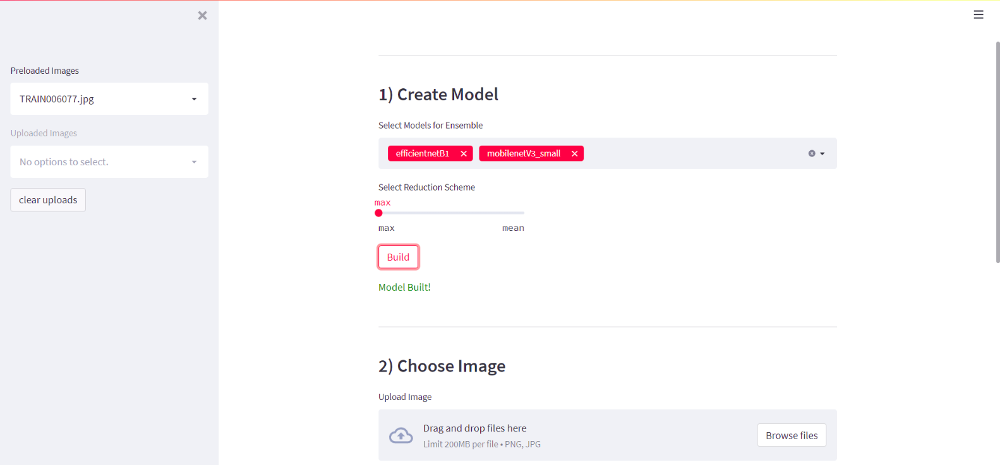
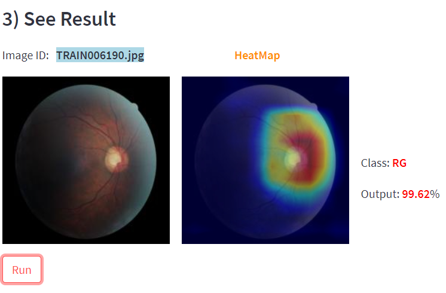

# Glaucoma-Detection-App


A minimal dashboard enabling the execution of PyTorch models in the browser, with the added capability to seamlessly run ensembles of models.





<br><br>

Run the app using the 'streamlit run' command in the terminal

```bash
streamlit run app.py
```


